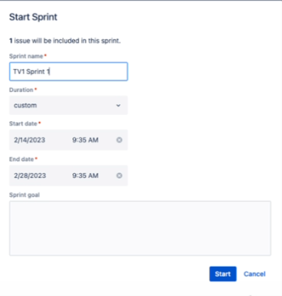

# How to create and use a Sprint in Jira.

A sprint — also known as an iteration — is a short period in which the development team implements and delivers a discrete and potentially shippable application increment, e.g. a working milestone version. In Jira, sprints are planned on the Backlog screen. 

## Prerequisities

Before creating a sprint in Jira, ensure you have completed the following:

- Created a Jira account.

- Created a [Jira Scrum project](https://support.atlassian.com/jira-software-cloud/docs/create-a-new-project/).

## Step 1: Create a sprint

1. Within your Scrum project, navigate to the **Backlog** project tab.

2. Click **Create sprint**.

    

## Step 2: Populate sprint 

Once you've created a sprint, you can fill your sprint with issues (also known as tickets) to keep track of the team's progress and to keep the workflow organized.

### Add existing issues to the sprint

If you there are issues in the backlog you want to add to the sprint, click and drag the issue from the backlog to be under the sprint.

### Add new issues to the sprint

1. Click **Create issue** under the sprint. 

2. From the drop-down menu, specify if this issue is a story, task, or bug.

    

3. Name your issue.

4. Press enter to finish creating the issue.

### Use epics to organize issues

story - most common, encompasses a single problem
organize by placing them in epic (on side)
divide story by adding subtasks

## Step 3: Start sprint

1. Click **Start sprint**.
2. In the pop-up window, specify the name of the sprint. You can also specify the duration or the start and end date. 

    

*It is recommended to not edit the details of a spring after it has started.*

## Step 4: Edit issues

mark story as done or closed instead of delete
cannot undo delete

edit ticket
on side bar: add description, comments, assignment, story points
set ticket as complete, complete sprint
remaining issues can be reorganized (backlog or to new sprint)

from backlog, add new sprints if needd
run one sprint at a time