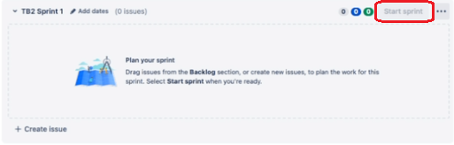

# How to create and use a Sprint in Jira.

A sprint in Jira is a set period of time during which the development team works to deliver a product increment by completing assigned issues. Sprints are planned on the Backlog tab, allowing your team to easily track progress, prioritize tasks, and manage the scope of the project. 

This guide will cover how to create, populate, and start a sprint in Jira.

## Prerequisites

Before creating a sprint in Jira, ensure you have the following:

- A Jira account.

- A [Jira Scrum project](https://support.atlassian.com/jira-software-cloud/docs/create-a-new-project/).

- Permission to manage sprints within the project.

## Step 1: Create a sprint

1. Within your Scrum project, navigate to the Backlog tab.

2. Click `Create sprint`.

    

## Step 2: Populate sprint 

Once you've created a sprint, you can add issues (also called tickets) to track the team's progress on the project and to organize the workflow.

### Add existing issues to the sprint

1. Identify which issues from the backlog should be added to the sprint.

2. Drag and drop the issue from the backlog to the desired sprint.

### Add new issues to the sprint

1. Click `+ Create issue` under the sprint. 

    

2. From the drop-down menu, specify if this issue is a `Story`, `Task`, or `Bug`. *Stories are most commonly used and they encompass a single problem.*

    

3. Name your issue. Press **Enter** to add it to the sprint.

4. To learn more about how to edit and configure issues, including adding subtasks, see [Create an issue and subtask](https://support.atlassian.com/jira-software-cloud/docs/create-an-issue-and-a-sub-task/).

### Optional: Organize issues under epics

You can group related stories and issues together using epics. *Epics allow you to better manage large initiatives that span across multiple sprints.*

To learn more about epics, see [Learn how to use epics in Jira](https://www.atlassian.com/agile/tutorials/epics).

## Step 3: Start sprint

1. In the `Backlog` tab, find the sprint you want to start and click `Start sprint`.

    

2. In the pop-up window, specify the following details:
    - The name of the sprint.
    - The duration or the start and end dates. 
    - Optionally, the sprint goal.

**Warning: Avoid editing the details of a sprint after starting as it can disrupt tracking and reporting.**

## Conclusion

Now you've learned how to create, fill, and start a sprint in Jira.

For more information on sprint management and best practices, see [Jira Cloud resources](https://support.atlassian.com/jira-software-cloud/resources/).
